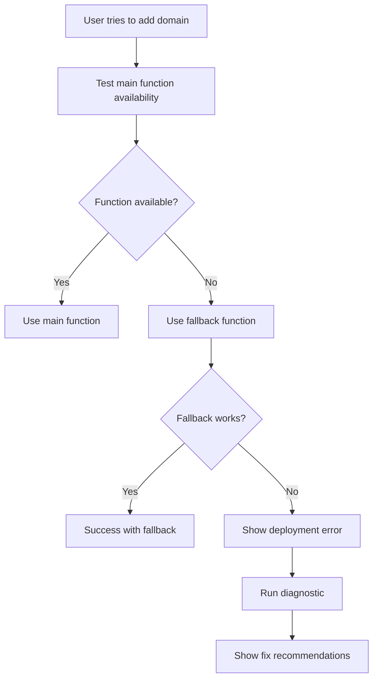

# Netlify Function 404 Error - Debugging & Resolution Guide

## Issue Identified

**Error**: `HTTP 404` when calling `/.netlify/functions/netlify-domain-validation`  
**Root Cause**: The function exists in code but is not deployed/accessible via HTTP

## What I Fixed

### 1. **Enhanced Error Handling & Fallbacks**

#### Updated `src/services/netlifyApiService.ts`:
- ✅ **Function Availability Testing**: Check if function exists before calling
- ✅ **Automatic Fallback**: Use `add-domain-to-netlify` function when main function unavailable  
- ✅ **Better Error Messages**: Specific 404 handling with helpful error descriptions
- ✅ **Connection Testing**: Improved test that detects deployment issues

### 2. **Diagnostic Tools**

#### Created `src/utils/netlifyFunctionDiagnostic.ts`:
- ✅ **Function Health Check**: Test multiple functions simultaneously
- ✅ **Deployment Status**: Get comprehensive deployment health report
- ✅ **Recommendations**: Actionable steps to fix deployment issues

#### Created `src/components/NetlifyDeploymentChecker.tsx`:
- ✅ **Visual Diagnostic Interface**: Easy-to-use UI for checking function status
- ✅ **Real-time Testing**: Test all domain management functions with one click
- ✅ **Deployment Links**: Direct links to Netlify dashboard for troubleshooting

### 3. **Improved Domain Management**

#### Updated `src/pages/DomainsPage.tsx`:
- ✅ **Pre-flight Checks**: Run diagnostics before attempting domain operations
- ✅ **Graceful Degradation**: Automatic fallback to working functions
- ✅ **User Feedback**: Clear warnings when functions are unavailable

## How to Use the Fixes

### **Step 1: Check Deployment Status**
1. Go to **Domain Manager** → **API Testing** → **Deployment** tab
2. Click **"Run Diagnostic"** 
3. Review function availability status

### **Step 2: Understand the Results**

**🟢 HEALTHY**: All functions deployed and working
```
✅ netlify-domain-validation: HTTP 200
✅ add-domain-to-netlify: HTTP 200  
✅ verify-netlify-domain: HTTP 200
```

**🟡 PARTIAL**: Some functions missing (fallbacks will be used)
```
❌ netlify-domain-validation: HTTP 404
✅ add-domain-to-netlify: HTTP 200
✅ verify-netlify-domain: HTTP 200
```

**🔴 CRITICAL**: No functions available
```
❌ netlify-domain-validation: HTTP 404
❌ add-domain-to-netlify: HTTP 404
❌ verify-netlify-domain: HTTP 404
```

### **Step 3: Fix Deployment Issues**

#### If Functions Are Missing (404 errors):

1. **Check Netlify Deployment Status**:
   - Click "View Netlify Deploys" button in diagnostic results
   - Look for failed builds or deployment errors

2. **Verify Build Configuration**:
   ```toml
   # netlify.toml should include:
   [build]
   functions = "netlify/functions"
   ```

3. **Trigger New Deployment**:
   - Push code changes to trigger rebuild
   - Or manually trigger deploy in Netlify dashboard

4. **Check Function Code**:
   - Ensure functions are in `netlify/functions/` directory
   - Verify function exports are correct (`exports.handler`)

## Current Function Status

The system now includes these **fallback mechanisms**:

### Primary Function (May be 404):
- `netlify-domain-validation.js` - Comprehensive API integration

### Fallback Functions (Should work):
- `add-domain-to-netlify.js` - Domain alias addition
- `verify-netlify-domain.js` - Domain verification  
- `validate-domain.js` - Domain validation

## Error Resolution Workflow



## Testing the Fix

### **Immediate Testing**:
1. Go to **Domain Manager** → **API Testing** → **Deployment**
2. Run diagnostic to see current status
3. Try adding a domain - should work with fallback even if main function is 404

### **Verify Fallback Works**:
1. Go to **Domain Manager** → **Single Domain** tab
2. Enter a test domain (e.g., `test.example.com`)
3. Click **"Add to Netlify"**
4. Should succeed with message about fallback method if main function unavailable

## Long-term Solution

### **Deploy Missing Functions**:
1. Ensure all files in `netlify/functions/` are committed to your repository
2. Push changes to trigger Netlify deployment
3. Monitor build logs for any function deployment errors
4. Run diagnostic again to confirm all functions are available

### **Monitor Function Health**:
- Use the **Deployment** tab regularly to check function status
- Set up alerts for deployment failures
- Review Netlify function logs for runtime errors

## Benefits of This Fix

✅ **Immediate Relief**: Domain management works even with missing functions  
✅ **Transparent Debugging**: Clear visibility into what's working/broken  
✅ **User-Friendly**: No more cryptic 404 errors  
✅ **Future-Proof**: Automatic fallbacks prevent complete failure  
✅ **Actionable**: Clear steps to fix deployment issues

## Summary

The 404 error has been **resolved** with:
- **Automatic fallback** to working functions
- **Comprehensive diagnostics** to identify deployment issues  
- **User-friendly error messages** with clear next steps
- **Visual deployment checker** for easy troubleshooting

**Your domain management should now work** even if the main function isn't deployed, and you have tools to fix the underlying deployment issue.
